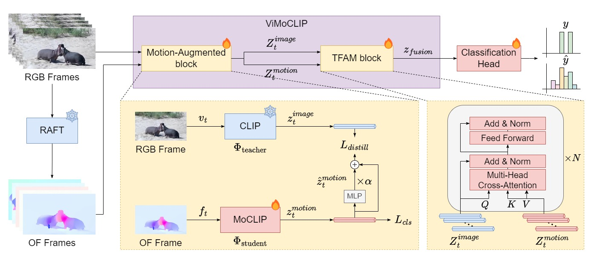

# ViMoCLIP: Video Motion CLIP for Animal Action Recognition

[](docs/ViMoCLIP_CVPR25.pdf)

ViMoCLIP is the official PyTorch implementation of our CVPR 2025 Workshop paper **“ViMoCLIP: Augmenting Static CLIP Representations with Video Motion Cues for Animal Action Recognition.”** It extends CLIP with motion‑aware embeddings extracted from optical flow via a teacher‑student distillation framework (MoCLIP) and fuses them through a cross‑attention Transformer block (TFAM). The approach sets a new state‑of‑the‑art on the challenging **Animal Kingdom** benchmark, reaching **77.09 mAP** without relying on text prompts.

<p align="center">
  
</p>

---

## Table of Contents

1. [Installation](#installation)
2. [Dataset Preparation](#dataset-preparation)
3. [Training Pipeline](#training-pipeline)
4. [Evaluation & Inference](#evaluation--inference)
5. [Project Structure](#project-structure)
6. [Reproducing CVPR Results](#reproducing-cvpr-results)
7. [Citation](#citation)

---

## Installation

### Prerequisites

* Python ≥ 3.12
* PyTorch ≥ 2.6
* NVIDIA GPU with ≥ 24 GB VRAM

```bash
# Clone repository
$ git clone https://github.com/MarcosRodrigoT/VIMO-CLIP.git
$ cd VIMO-CLIP

# (Optional) create virtual environment
$ python -m venv venv
$ source venv/bin/activate

# Install dependencies
$ pip install -r requirements.txt
```

---

## Dataset Preparation

ViMoCLIP is evaluated on the **Animal Kingdom** dataset. Please request access from the [original authors](https://sutdcv.github.io/Animal-Kingdom/) (please note that only the [action recognition](https://github.com/sutdcv/Animal-Kingdom/tree/master/Animal_Kingdom/action_recognition/dataset) directory is needed). We provide the ground truth annotations in this repository (as we modified how these were stored by the original authors). The `dataset` directory should be structured as:

```text
./dataset/
├─ annotations/             # Ground truth annotations
│   ├── ak_action.csv
│   ├── train_multi.txt
│   └── val_multi.txt
├─ embeddings/              # CLIP frame embeddings
├─ flows/                   # RAFT optical‑flow videos
└─ videos/                  # RGB videos
```

Download the individual videos from the **Animal Kingdom** dataset and place them in the `dataset/videos` directory. 

- RGB → CLIP embeddings

  In order to extract CLIP frame embeddings from the original videos, please run the following:

  ```bash
  python extract_embeddings.py
  ```

  This python module will extract the frame CLIP embeddings directly to the `dataset/embeddings` directory.

- RGB → RAFT optical Flow

  In order to extract RAFT optical-flow videos, please follow the [authors' installation instructions](https://github.com/princeton-vl/RAFT) and extract optical-flow videos from all the original ones and place them in the `dataset/flows` directory.

  Another alternative is to follow the [ptlflow](https://github.com/hmorimitsu/ptlflow) repository, which supports multiple different optical-flow methods as demonstrated in the following script:

  ```python
  import os
  import cv2 as cv
  import torch
  import ptlflow
  import numpy as np
  from ptlflow.utils import flow_utils
  from ptlflow.utils.io_adapter import IOAdapter


  def compute_optical_flow_video(video_path, output_path, model, device):
      cap = cv.VideoCapture(video_path)

      success, prev_frame = cap.read()
      if not success:
          print(f"Could not read {video_path}")
          return

      height, width = prev_frame.shape[:2]
      io_adapter = IOAdapter(model.module if isinstance(model, torch.nn.DataParallel) else model, (height, width))

      fourcc = cv.VideoWriter_fourcc(*"mp4v")
      fps = cap.get(cv.CAP_PROP_FPS) or 25
      out = cv.VideoWriter(output_path, fourcc, fps, (width, height))

      with torch.no_grad():
          while True:
              success, curr_frame = cap.read()
              if not success:
                  break

              # ---- prepare the two-frame clip ----
              pair_np = np.stack([prev_frame, curr_frame], axis=0)  # [2, H, W, C]
              inputs = io_adapter.prepare_inputs(pair_np)
              inputs["images"] = inputs["images"].to(device, non_blocking=True)

              # ---- inference ----
              predictions = model(inputs)
              flow = predictions["flows"].cpu()  # [1, 2, H, W]

              # ---- visualise & write ----
              flow_rgb = flow_utils.flow_to_rgb(flow)[0, 0]  # [3, H, W]
              flow_rgb = flow_rgb.permute(1, 2, 0).numpy()  # HWC
              flow_bgr = cv.cvtColor((255 * flow_rgb).clip(0, 255).astype("uint8"), cv.COLOR_RGB2BGR)
              out.write(flow_bgr)

              prev_frame = curr_frame  # slide the window

      cap.release()
      out.release()
      print(f"Saved optical flow video to: {output_path}")


  def main(dataset_dir, output_dir, model_name, ckpt_path):
      os.makedirs(output_dir, exist_ok=True)

      if not torch.cuda.is_available():
          raise RuntimeError("CUDA is not available.")

      device = torch.device("cuda")
      model = ptlflow.get_model(model_name, ckpt_path=ckpt_path)
      model = torch.nn.DataParallel(model).to(device)
      model.eval()

      video_extensions = (".mp4", ".avi", ".mov", ".mkv")
      video_files = [f for f in os.listdir(dataset_dir) if f.lower().endswith(video_extensions)]

      for filename in sorted(video_files):
          video_path = os.path.join(dataset_dir, filename)
          output_path = os.path.join(output_dir, f"{os.path.splitext(filename)[0]}_{model_name}_{ckpt_path}.mp4")
          compute_optical_flow_video(video_path, output_path, model, device)


  if __name__ == "__main__":
      DATASET_DIR = "dataset/videos/"
      OUTPUT_DIR = "dataset/flows/"
      MODEL_NAME = "raft"
      CKPT_PATH = "things"

      main(DATASET_DIR, OUTPUT_DIR, MODEL_NAME, CKPT_PATH)

  ```

---

## Training and Evaluation Pipeline

1. Train the motion student model (MoCLIP)

    ```bash
    python train.py \
      --train-hdf5-path dataset/embeddings/ak_train_clip_embeddings.h5  \
      --val-hdf5-path   dataset/embeddings/ak_val_clip_embeddings.h5    \
      --flow-videos-dir dataset/flows                                   \
      --epochs                  10                                      \
      --batch-size              32                                      \
      --num-workers             4                                       \
      --learning-rate           1e-3                                    \
      --grad-clip-norm          None                                    \
      --distillation-loss-mode  cosine                                  \
      --num-classes             140                                     \
      --sequence-length         30                                      \
      --residual-alpha          0.1                                     \
      --class-positive-weight   9
    ```

    Checkpoints and TensorBoard logs are written to `checkpoints/<timestamp>/` and `logs/<timestamp>/` respectively.

2. Export motion embeddings

    ```bash
    python inference.py \
      --flow_videos_dir dataset/flows                         \
      --checkpoint_dir  checkpoints/20250328-003544           \
      --output-h5-path  dataset/embeddings/flow_embeddings.h5 \
      --clip-model-name ViT-B/32                              \
      --batch-size      1                                     \
      --num-workers     20                                    \
      --num-classes     140
    ```

3. Train and evaluate ViMoCLIP (MoCLIP + TFAM Fusion)

    ```bash
    cd TFAM
    bash run_experiments.sh
    ```

---

## Citation

If you use this repository, please cite:

```bibtex
@inproceedings{rodrigo2025vimoclip,
  title     = {ViMoCLIP: Augmenting Static CLIP Representations with Video Motion Cues for Animal Action Recognition},
  author    = {Rodrigo, Marcos and Zhong, Enmin and del-Blanco, Carlos R. and Cuevas, Carlos and Jaureguizar, Fernando and Garc\'ia, Narciso},
  booktitle = {Proceedings of the IEEE/CVF Conference on Computer Vision and Pattern Recognition},
  year      = {2025}
}
```
